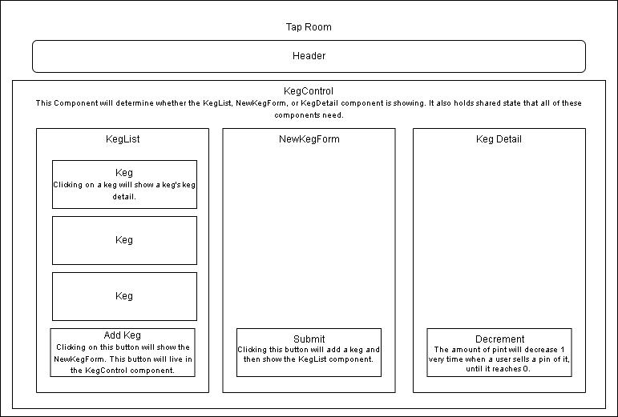

# Tap Room

#### _An App to check how many kegs a bar has._

#### By _**Sisi Vieira**_

## Github page website
https://cicy886.github.io/tap-room/

## Taproom Diagram:

 

## Technologies Used

* JavaScript
* React.js
* Git

## Description

* A user can see a list of all avilable kegs. There are name, brand, price and alcoholContent for each keg.
* A user can submit a form to add a new keg to a list.
* A user can click on a keg too see its details.
* A suere can see how many pints are left in a keg.
* A user can click the "sell pint" button whenever they seel a pint of it. This should decrease the number of pints left by 1. Pints should not be able to go below 0.

## Setup and Use

### Installation

1. Clone the repository: `$ git clone https://github.com/cicy886/tap-room.git`
2. Navigate to the `/tap-room` directory on your computer
3. Open with your preferred text editor to view the code base
4. To start a development server and view the project in the browser:
   - Navigate to `/tap-room` in your command line
   - Run the command `npm install` to install dependencies
   - Optionally, run the commmand `npm run build` to make a bundle of the files
   - Finally, run the command `npm run start` to start a development server

## Known Bugs

No Known Bugs

## License

[MIT](https://opensource.org/licenses/MIT)

Copyright (c) **2022 Sisi Vieira**

## Contact Information

Sisi Vieira cicy886@gmail.com
